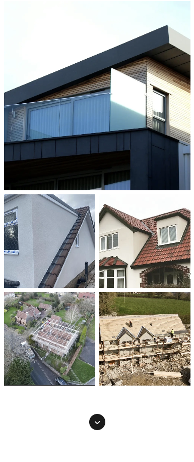
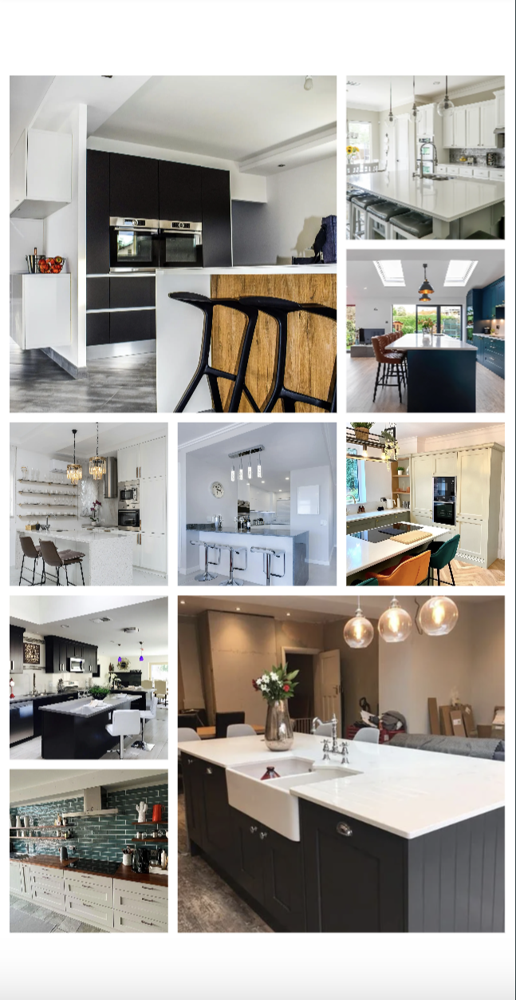

# Project Milestone 1 for Code Institute - User Centric Frontend Development

<br>


<br>

[Live website preview](https://vadimsj.github.io/redland-renovations)

### Contents
- [Summary](#summary)
- [User experience (UX)](#user-experience-ux)
  - [User stories](#user-stories)
  - [UX Planes](#ux-planes)
    - [Strategy](#strategy)
    - [Scope](#scope)
    - [Structure](#structure)
    - [Wireframes](#wireframes)
    - [Design](#design)
  - [Features](#features)
    - [Existing features](#existing-features)
    - [Features left to implement](#features-left-to-implement)
  - [Content](#content)
- [Credits](#credits)
- [Testing](#testing)
- [Technologies used](#technologies-used)
- [Deployment](#deployment)

## Summary

- This website has been built to improve the existing website for Redland Renovations, which serves as a portfolio and point of contact for a property renovation company in Bristol, UK.

-  The website intended to function as a landing page for the prospective visitors.

-  It features essential information about the company, its services, and portfolio of images of the previous works. 

- The main purpose of the website is to convert prospective visitors into leads and capture their contact details.

## User experience (UX)

### User stories

- A. First Time Visitor Goals

    As a first-time visitor, I would like to:

  1. Identify the nature of the business and specialization of the company.
  2. Locate where the company is based and its areas of operation.
  3. Determine what services the company offers and the scope of work undertaken.
  4. Explore the company's portfolio showcasing previously completed projects.
  5. Find essential information about the company.
  6. Contact the company.

- B. Returning Visitor Goals

    As a Ruturning visitor, I would like to:
   1. Easily navigate through the website to access different pages and return to the home page if needed.
    2. Quickly contact the company or request a callback.

- C. Website Owner Goals

    As a website owner, I would like to:
  1. Introduce the company and it's services to the website visitors.
  2. Present essential company information in a user-friendly format.
  3. Showcase the company's portfolio of previously completed works.
  4. Offer a various options for customers to get in touch.
  5. Capture the leads from incoming inquiries. (out of scope for this project)


## UX Planes

### Strategy
  - Project Goals
    - Design a website that is simple yet intuitive to use and accessible to audience of all ages and technical abilities.
    - Build a fully responsive website accessible from all devices.
    - Optimize accessibility of the website.
    - Optimize the website to enhance lead conversion.

  - Company Goals
    - Improve the online presence and corporate image of the company.
    - Expand the customer base and boost sales.

### Scope
  - Due to constraints of set requirements, website is built using vanilla HTML5, CSS3 and JavaScript. Backend development is out of scope for this project.
  
  - Feature requirements:
    - Website is static but responsive.
    - Website is intuitive and user-friendly.
    - Website is accessible on various devices.
    - Website is accessible to audience of all ages and technical abilities.
    - Website is developed with a mobile-first approach.

-  Content requirements:
   - Key information about the company is easily accessible.
   - Website is visually engaging, featuring a multitude of images across its pages.
   - Content is presented in a format that is easy for users to understand and absorb.
   - Website is presented in a professional yet friendly manner.

### Structure
  - Website is designed as a single landing page.
  - Website has single primary call-to-action for its visitors. 
  - Website is structured to guide visitors towards the primary call-to-action.

  - Website is divided into the following sections or pages:
    - Home
    - Services
    - Gallery
    - About Us
    - Contact
    - Footer

  - Website features a navigation bar with the following links:
    - Home Page (Button hidden in Logo)
    - Services
    - Gallery
    - About us
    - Contact

### Wireframes

  <details>
  <summary>Mobile</summary>

  

  </details>

  <details>

  <summary>Desktop</summary>

  

  </details>

### Design

  - Color Scheme
  
    

  - Typography
    - Headings are formatted using the ['Suez One' font](https://fonts.google.com/specimen/Suez+One?query=suez).

      
        
  
    -  Text content is formatted using the ['Inter' font, a sans-serif typeface](https://fonts.google.com/specimen/Inter?preview.text=Inter&query=Inter&stroke=Sans+Serif).

        
        
  <details>
  - <summary>Imagery</summary>

  - Logo

    

  - Hero Image

    

  - Roofing & loft extensions
      
  - Plastering, rendering, insulation & stonemasonry
      
  - Kitchen installations
      
  - Gardening work
      
  - Fencing & stone/brick wall
      
  - Heating systems
      
  - Driveways, patios & decking
      
      </details>

 ### Features 

#### Existing Features: 


- Header + Navigation bar desktop layout

    

<br>

 - Header + Hamburger menu mobile layout

    

    

<br>

- Home Page

  - Mobile

    


  - Desktop

    

<br>


- Services Section


<br>

- Call to action bar


<br>

- Gallery Sections

  - Mobile layout folded

    

  <br>

  - Mobile layout expanded

    

  <br>

    - Tablet layout folded

      

  <br>

    - Tablet layout expanded

      

  <br>

  - Desktop layout folded

    

  <br>

    - Desktop layout expanded

      

  <br>

- About us section

  

  <br>

- Unique selling proposition bar

  

  <br>

- Contact us form

  

  <br>

- Footer

  

  <br>

- Thank you page

  

  <br>

- Error 404 page

  

  <br>

#### Features left to implement:

- Image slider showcasing images from the gallery sections full screen.

## Content 

- Photos and text content were taken from the existing Redland Renovations website.

- Font styles and colors were taken from the existing Redland Renovations website.

- Dummy images were taken from [Pexels](https://www.pexels.com/).

## Credits 

 - [Code Institute Template](https://github.com/Code-Institute-Org/gitpod-full-template) was used as a starting point for this project. 

- Hamburger menu navigation was implemented following the tutorial from [Web Dev Simplified](https://youtu.be/dAIVbLrAb_U?feature=shared) and [Codehal](https://youtu.be/yE9DLIoDwCg?si=tdUV7CXiDz9H3GQ7).

- Intersection observer to switch the visibility of the elements was implemented following the tutorial from [Beyond Fireship](https://youtu.be/T33NN_pPeNI?feature=shared).

- Text reveal-on-scroll effect was implemented following the tutorial from [WebStylePress](https://youtu.be/v_aEkNm6xec?si=DMN5NkE6uMworW03).

- Text highlight-on-scroll effect implemented following the tutorial from [Kevin Powell](https://youtu.be/d10GaL6F-lA?si=P76YRdT3HJW5hQUs).

## Testing 

Testing results can be found in [testing.md](./testing.md).

## Tools and technologies used

- [HTML](https://web.dev/learn/html/overview/) - was used to provide structure for this project.

- [CSS](https://developer.mozilla.org/en-US/docs/Web/CSS) - was used to style the HTML elements.

- [JavaScript](https://developer.mozilla.org/en-US/docs/Web/JavaScript) - was used to add additional styling effects and form validation functions. 

- [GitHub](https://github.com/) - is the hosting site used to store the code for the website.

- [Cloudflare](https://www.cloudflare.com/) - was used as custom domain provider for demo website.

- [Git](https://git-scm.com/) - was used as a version control software to commit and push the code to the GitHub repository.

- [VS Code](https://code.visualstudio.com/) - was used as local IDE.

- [Balsamiq](https://balsamiq.com/) - was used to create the wireframes for the website.

- [Figma](https://www.figma.com/) - was used for svg editing.

- [Inkscape](https://inkscape.org/) - was used for svg editing.

- [imageresizer.com](https://imageresizer.com/) - was used to resize and compress images.

- [Pixelied](https://pixelied.com/) - was used to convert the format of the files.

- [Google fonts](https://fonts.google.com/) - was used to source ['Suez One' font](https://fonts.google.com/specimen/Suez+One?query=suez).

- [fontsquirrel.com](https://www.fontsquirrel.com/) - was used to compress font.

- [screenspan.net](https://screenspan.net/) - was used to generate fallback font.

- [svgrepo.com](https://www.svgrepo.com/) - was used to source arrow icons.

- [Coolors.co](https://coolors.co/) - was used to display the colour scheme.

- [Google Chrome Developer Tools](https://developer.chrome.com/docs/devtools/overview/) - was used during testing, debugging and making the website responsive.

- [Mozilla Developer Tools](https://firefox-source-docs.mozilla.org/devtools-user/) - was used during testing, debugging and making the website responsive.

- [Google Lighthouse](https://developer.chrome.com/docs/lighthouse/overview) - was used during the performance testing of the website.

- [W3C HTML Validator](https://validator.w3.org/) - was used to check for errors in the HTML code.

- [W3C CSS Validator](https://jigsaw.w3.org/css-validator/) - was used to check for errors in the CSS code.

- [Wave.webaim](https://wave.webaim.org/) - Was used during the testing accessibilty of the website.


## Deployment

- Navigate to the root project repository in GitHub.
- Click on "Settings" in the header menu.
- Click on "Pages" on the menu on the left to open GitHub Pages window.
- From the drop down menu under source select "deploy from branch".
- From the drop down menu under branch select "main" (or select another branch for GitHub to deploy).
- Click "Save".

### Creating a fork

- Navigate to the Redland Renovations root [repository](https://github.com/vadimsj/redland-renovations).
- In the top-right corner of the page click on the fork button and select "create a fork".
- You can change the name of the fork and add description.
- Choose to copy only the main branch or all branches to the new fork.
- Click "Create a Fork". A repository should appear in your GitHub.

### Cloning repository

Open terminal at your working directory and type:
```html
sudo git clone https://github.com/vadimsj/redland-renovations.git
```
