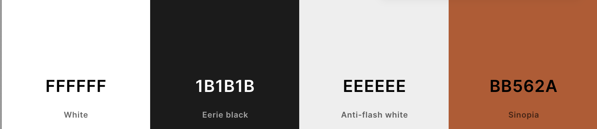

# Redland Renovations

- This website has been built to improve the existing website for Redland Renovations, which serves as a portfolio and point of contact for a property renovation company in Bristol, UK.

-  The website intended to function as an introductory presentation of the business for prospective visitors. It features essential information about the company and aims to motivate visitors to reach out.

- The purpose of the website is to convert prospective visitors into leads and capture their contact details.

## User Eperience (UX)

### User stories

- A. First Time Visitor Goals

    As a first-time visitor, I would like to:
  1. Identify the nature of the business and specialization of the company.
  2. Locate where the company is based and its areas of operation.
  3. Determine what services the company offers and the scope of work undertaken.
  4. Explore the company's portfolio showcasing previously completed projects.
  5. Find essential information about the company.
  6. Contact the company.

- B. Returning Visitor Goals

    As a Ruturning visitor, I would like to:
   1. Easily navigate through the website to access different pages and return to the home page if needed.
    2. Quickly contact the company or request a callback.
   
- C. Frequent User Goals

    As a Frequent User, I would like to:
   1. Easily navigate through the website to access different pages and return to the home page if needed.
    2. Quickly contact the company or request a callback.

- D. Website Owner Goals

    As a website owner, I would like to:
  1. Introduce the company and it's services to the website visitors.
  2. Present essential company information in a user-friendly format.
  3. Showcase the company's portfolio of previously completed works.
  4. Offer a convenient means for customers to get in touch.
  5. Capture the leads from incoming inquiries.


## UX Planes

- Strategy
  - Project Goals
    - Design a website that is simple yet intuitive to use and accessible to audience of all ages and technical abilities.
    - Build a fully responsive website accessible from all devices.
    - Optimize accessibility of the website.
    - Optimize the website to enhance lead conversion.

  - Company Goals
    - Improve the online presence and corporate image of the company.
    - Expand the customer base and boost sales.

- Scope
    - Due to constraints of using HTML5 and CSS3, only ensure a simple but accessible layout.
  
    - Feature requirements:
      - The website is static but responsive.
      - The website is intuitive and user-friendly.
      -  Website is accessible on various devices.
      - Website is accessible to audience of all ages and technical abilities.

   -  Content requirements:
      -  Key information about the company is easily accessible.
      -  The website is visually engaging, featuring a multitude of images across its pages.
      - Content is presented in a format that is easy for users to understand and absorb.
      - The website is presented in a professional yet friendly manner.
      - The website has only essential content and serves solely as an introductory presentation.
      - The website instills confidence and prompts visitors to initiate contact with the company.

- Structure
  - The website is designed as a single landing page.
  - The website has single primary call-to-action for its visitors. 
  - The website is structured to guide visitors towards the primary call-to-action.

  - The website is divided into the following sections or pages:
    -  Home
    -  Services
    -  Gallery
    -  About Us
    -  Contact

  - The website features a navigation bar with the following links:
    - Services
    - Gallery
    - Contact

- Skeleton

  - Wireframes

  

- Surface

  - Color Scheme
        

  - Typography
    - Headings are formatted using the 'Suez One' font, a serif typeface.

        

        Link to google fonts: https://fonts.google.com/specimen/Suez+One?query=suez

    - The remaining text content is formatted using the 'Inter' font, a sans-serif typeface.
  
        

        Link to google fonts: https://fonts.google.com/specimen/Inter?preview.text=Inter&query=Inter&stroke=Sans+Serif

    - Code to link google fonts in HTML:
    ```html
    <link rel="preconnect" href="https://fonts.googleapis.com">
    <link rel="preconnect" href="https://fonts.gstatic.com" crossorigin>
    <link href="https://fonts.googleapis.com/css2?family=Inter&family=Suez+One&display=swap" rel="stylesheet">

  - Imagery

## Features 

### Existing Features

- __Feature__

  - Description


### Features Left to Implement

- Another feature idea

## Testing 

### Validator Testing 

- HTML
  - No errors were returned when passing through the official [W3C validator](https://)
- CSS
  - No errors were found when passing through the official [(Jigsaw) validator](https://)

### Unfixed Bugs

## Deployment

- The site was deployed to GitHub pages. The steps to deploy are as follows: 
  - In the GitHub repository, navigate to the Settings tab 
  - From the source section drop-down menu, select the Master Branch
  - Once the master branch has been selected, the page will be automatically refreshed with a detailed ribbon display to indicate the successful deployment. 

The live link can be found here - https://

## Credits 

### Content 

- The text for the Home page was taken from 
- Instructions on how to implement ... on the ... page was taken from [Specific YouTube Tutorial](https://www.youtube.com/)
- The icons in the footer were taken from [Font Awesome](https://fontawesome.com/)

### Media

- The photos used on the home and sign up page are from This Open Source site
- The images used for the gallery page were taken from this other open source site

