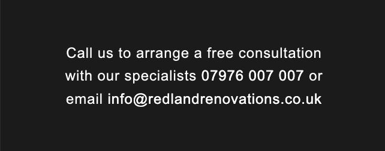

# Redland Renovations

  

  [Live website preview](https://vadimsj.github.io/redland-renovations)

## Table of Contents
- [Summary](#summary)
- [User Experience (UX)](#user-experience-ux)
  - [User Stories](#user-stories)
  - [UX Planes](#ux-planes)
    - [Strategy](#strategy)
    - [Scope](#scope)
    - [Structure](#structure)
    - [Skeleton](#skeleton)
    - [Surface](#surface)
  - [Features](#features)
    - [Existing Features](#existing-features)
    - [Features Left to Implement](#features-left-to-implement)
  - [Content](#content)
- [Credits](#credits)
- [Testing](#testing)
- [Technologies Used](#technologies-used)

## Summary

- This website has been built to improve the existing website for Redland Renovations, which serves as a portfolio and point of contact for a property renovation company in Bristol, UK.

-  The website intended to function as a landing page for the prospective visitors.

-  It features essential information about the company and its services, and aims to motivate visitors to reach out. 

- The main purpose of the website is to convert prospective visitors into leads and capture their contact details.

## User Eperience (UX)

### User stories

- A. First Time Visitor Goals

    As a first-time visitor, I would like to:
  1. Identify the nature of the business and specialization of the company.
  2. Locate where the company is based and its areas of operation.
  3. Determine what services the company offers and the scope of work undertaken.
  4. Explore the company's portfolio showcasing previously completed projects.
  5. Find essential information about the company.
  6. Contact the company.

- B. Returning Visitor Goals

    As a Ruturning visitor, I would like to:
   1. Easily navigate through the website to access different pages and return to the home page if needed.
    2. Quickly contact the company or request a callback.

- C. Website Owner Goals

    As a website owner, I would like to:
  1. Introduce the company and it's services to the website visitors.
  2. Present essential company information in a user-friendly format.
  3. Showcase the company's portfolio of previously completed works.
  4. Offer a various options for customers to get in touch.
  5. Capture the leads from incoming inquiries.

### UX Planes

- Strategy
  - Project Goals
    - Design a website that is simple yet intuitive to use and accessible to audience of all ages and technical abilities.
    - Build a fully responsive website accessible from all devices.
    - Optimize accessibility of the website.
    - Optimize the website to enhance lead conversion.

  - Company Goals
    - Improve the online presence and corporate image of the company.
    - Expand the customer base and boost sales.

- Scope
    - Due to constraints of set requirements, website is built predominantly using vanilla HTML5 and CSS3, minimaising the usage of JavaScript.
  
    - Feature requirements:
      - Website is static but responsive.
      - Website is intuitive and user-friendly.
      - Website is accessible on various devices.
      - Website is accessible to audience of all ages and technical abilities.
      - Website is developed with a mobile-first approach.

   -  Content requirements:
      -  Key information about the company is easily accessible.
      -  Website is visually engaging, featuring a multitude of images across its pages.
      - Content is presented in a format that is easy for users to understand and absorb.
      - Website is presented in a professional yet friendly manner.
      - Website has only essential content and serves solely as an introductory presentation.
      - Website instills confidence and prompts visitors to initiate contact with the company.

- Structure
  - Website is designed as a single landing page.
  - Website has single primary call-to-action for its visitors. 
  - Website is structured to guide visitors towards the primary call-to-action.

  - Website is divided into the following sections or pages:
    -  Home
    -  Services
    -  Gallery
    -  About Us
    -  Contact

  - Website features a navigation bar with the following links:
    - Services
    - Gallery
    - Contact

- Skeleton

  - Wireframes

  

- Surface

  - Color Scheme
  
    

  - Typography
    - Headings are formatted using the ['Suez One' font, a serif typeface](https://fonts.google.com/specimen/Suez+One?query=suez).

      
        
  
    -  Text content is formatted using the ['Inter' font, a sans-serif typeface](https://fonts.google.com/specimen/Inter?preview.text=Inter&query=Inter&stroke=Sans+Serif).

        
        

    - Arrow icon was created using the ["Quicksand" font, a sans-serif typeface](https://fonts.google.com/specimen/Quicksand?query=quicksand)
.

        
        
  - Imagery
    - Logo
  
      
  
    - Hero Image

      
  
    - Roofing & loft extensions
        

    - Plastering, rendering, insulation & stonemasonry
        

    - Kitchen installations
        

    - Gardening work
        

    - Fencing & stone/brick wall
        

    - Heating systems
        

    - Driveways, patios & decking
        

## Features 

### Existing Features

  - Header + Navigation bar

    

  - Hamburger menu

    

  - Menu Sidebar

    

  - Home Page

    

  - Services Section

    

  - Call to action bar

    

  - Gallery Sections
  
    - Desktop layout

      
      

    - Mobile layout (alternative side)

      

  - About us section

      

  - Unique selling proposition bar

      

  - Contact us section

      

  - Footer

      

### Features Left to Implement

- Image slider showcasing images from the gallery sections full screen - given the specific scope of this project, it was decided not to implement this feature, as it would require JavaScript to achieve the desired effectiveness.

### Content 

- Photos and text content were taken from the existing Redland Renovations website.

- Font styles and colors were taken from the existing Redland Renovations website.

## Credits 

 - [Code Institute Template](https://github.com/Code-Institute-Org/gitpod-full-template) was used as a starting point for this project. 

- Hamburger menu navigation was implemented following the tutorial from [Web Dev Simplified](https://youtu.be/dAIVbLrAb_U?feature=shared).

- Intersection observer was implemented following the tutorial from [Beyond Fireship](https://youtu.be/T33NN_pPeNI?feature=shared).

## Testing 

Testing results can be found in [testing.md](./testing.md).

## Technologies used

HTML -

CSS -

JavaScript -

GitHub -

Git -

Balsamiq -

Google fonts -

Google Vhrom Lighthouse -

Google Chrome Developer Tools -

Mozilla Developer Tools -

W3C HTML Validator -

W3C CSS Validator -

Online Convert -

Coolors.co -

ui.dev/amiresponsive - 

