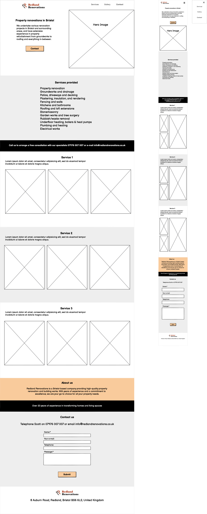

# Redland Renovations

- This website has been built to improve the existing website for Redland Renovations, which serves as a portfolio and point of contact for a property renovation company in Bristol, UK.

- The purpose of the website is to convert prospective visitors into leads and capture their contact details.

- The website is designed as a landing page with a single main call-to-action for its visitors, which is to contact the company.

## User Eperience (UX)

### User stories

- A. First Time Visitor Goals

    As a first-time visitor, I would like to:
  1. Quickly identify the nature of the business and specialization of the company.
  2. Determine the company's location and areas of operation.
  3. Determine the types of services the company offers and the scope of work undertaken.
  4. Explore the company's portfolio showcasing previously completed projects.
  5. Easily locate essential information about the company.
  6. Contact the company in the preferred way.

- B. Returning Visitor Goals

    As a Ruturning visitor, I would like to:
   1. Easily navigate through the website to access different pages and return to the home page if needed.
    2. Quickly access the call-to-action.
   
- C. Frequent User Goals

    As a Frequent User, I would like to:
   1. Easily navigate through the website to access different pages and return to the home page if needed.
    2. Quickly access the call-to-action.

- D. Website Owner Goals

    As a website owner, I would like to:
  1. Introduce the company to the website visitors.
  2. Present essential company information in a convenient format.
  3. Showcase the company's portfolio of previously completed works.
  4. Provide convenient point of contact for customers.
  5. Capture the leads from incoming inquiries.

## UX Planes

- Strategy
  - Project Goals
    - Design a website that is simple yet intuitive to use and accessible to audience of all ages and technical abilities.
    - Build a fully responsive website accessible from all devices.
    - Optimise accessibility of the website.
    - Optimise the website to enhance lead conversion.

  - Company Goals
    - Improve the online presence and corporate image of the company.
    - Expand the customer base and boost sales.

- Scope
    - Due to constraints of using HTML5 and CSS3, only ensure a simple but accessible layout.
  
    - Feature requirements:
      - The website is static but responsive.
      - The website is intuitive and user-friendly.
      -  Website is accessible on various devices.
      - Website is accessible to audience of all ages and technical abilities.

   -  Contents requirements:
      -  Key information about the company is easily accessible.
      -  The website is visually engaging, featuring a multitude of images across its pages.
      - Content is presented in a format that is easy for users to understand and absorb.
      - The website is presented in a professional yet friendly manner.

- Structure
  - The website is designed as a single landing page.
  - The website is structured to direct visitors towards the primary call to action.

  - The website includes the following pages:
    -  Home
    -  Services
    -  Gallery
    -  About Us
    -  Contact

  - The website features a navigation bar with the following links:
    - Services
    - Gallery
    - Contact

- Skeleton

  - Wireframes

  

- Surface

  - Color Scheme

  - Typography

  - Imagery

## Features 

### Existing Features

- __Feature__

  - Description

### Features Left to Implement

- Another feature idea

## Testing 

### Validator Testing 

- HTML
  - No errors were returned when passing through the official [W3C validator](https://)
- CSS
  - No errors were found when passing through the official [(Jigsaw) validator](https://)

### Unfixed Bugs

## Deployment

This section should describe the process you went through to deploy the project to a hosting platform (e.g. GitHub) 

- The site was deployed to GitHub pages. The steps to deploy are as follows: 
  - In the GitHub repository, navigate to the Settings tab 
  - From the source section drop-down menu, select the Master Branch
  - Once the master branch has been selected, the page will be automatically refreshed with a detailed ribbon display to indicate the successful deployment. 

The live link can be found here - https://

## Credits 

In this section you need to reference where you got your content, media and extra help from. It is common practice to use code from other repositories and tutorials, however, it is important to be very specific about these sources to avoid plagiarism. 

You can break the credits section up into Content and Media, depending on what you have included in your project. 

### Content 

- The text for the Home page was taken from Wikipedia Article A
- Instructions on how to implement form validation on the Sign Up page was taken from [Specific YouTube Tutorial](https://www.youtube.com/)
- The icons in the footer were taken from [Font Awesome](https://fontawesome.com/)

### Media

- The photos used on the home and sign up page are from This Open Source site
- The images used for the gallery page were taken from this other open source site

