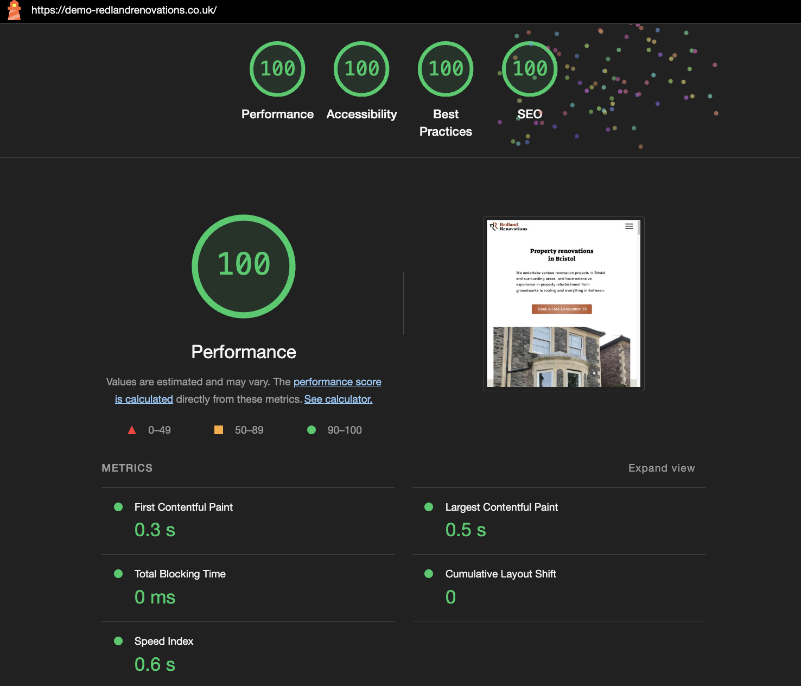
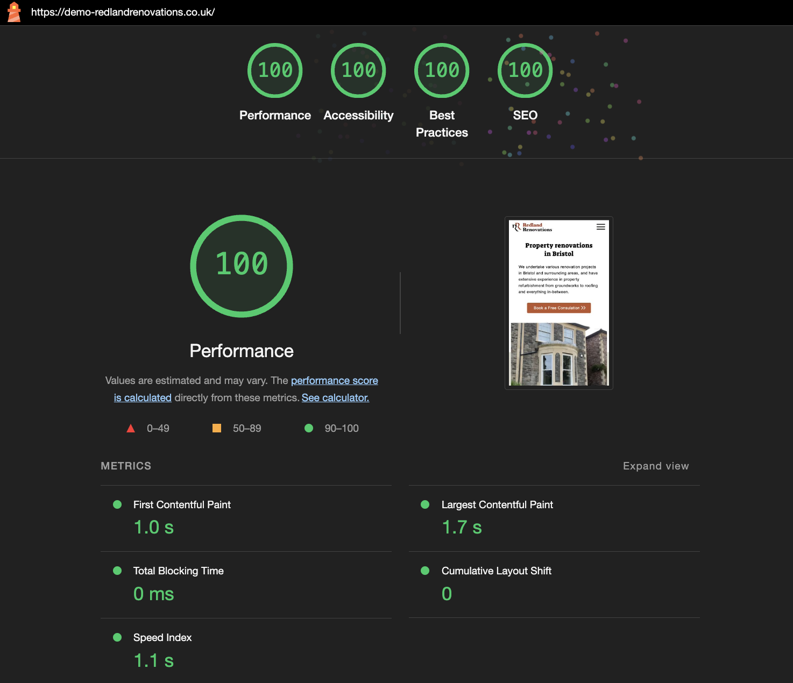
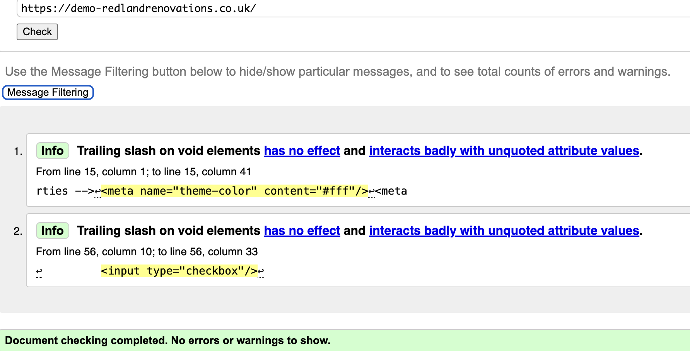
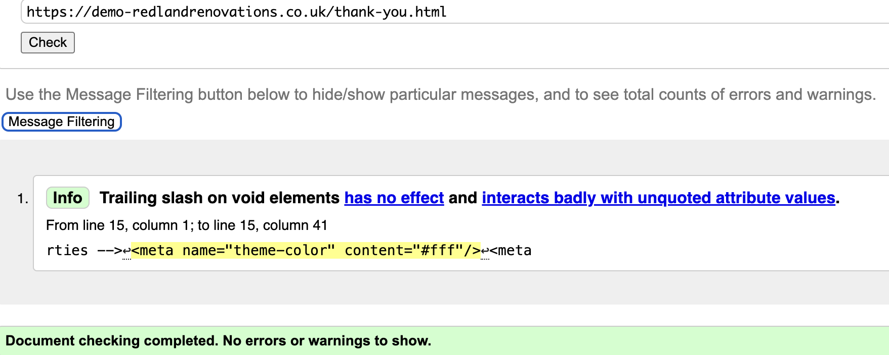
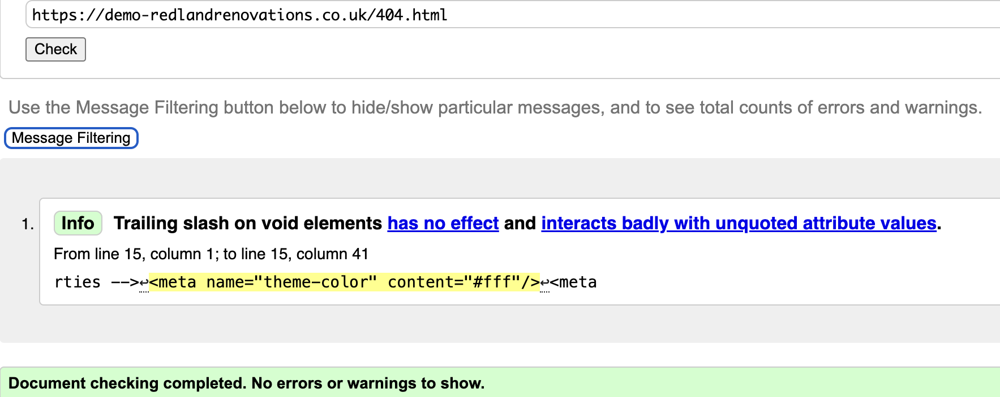
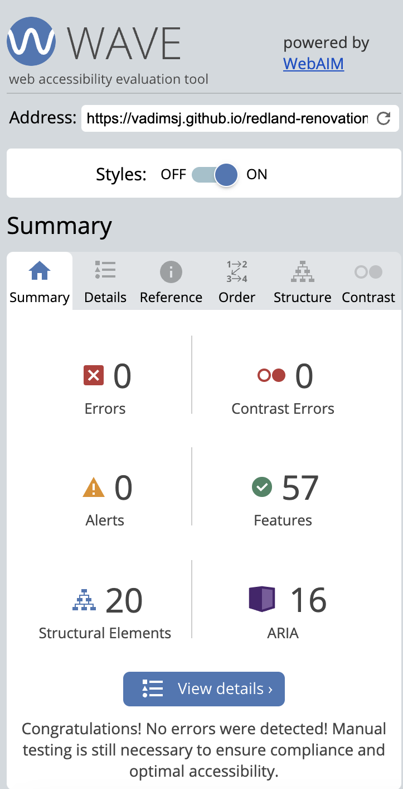

# Redland Renovations Testing Documentation

[Live website preview](https://vadimsj.github.io/redland-renovations)

[Github repository](https://github.com/vadimsj/redland-renovations)

### Contents:

### Tools used for testing:

- [Google Lighthouse extension](https://developer.chrome.com/docs/lighthouse/overview)
- [W3C Html validator](https://validator.w3.org/nu/)
- [W3C CSS (Jigsaw) Validator](https://jigsaw.w3.org/css-validator/)
- [WAVE Web Accessibility Evaluation Tool](https://wave.webaim.org/)

## User story testing

- A. First Time Visitor Goals

    As a first-time visitor, I would like to:
  1. Identify the nature of the business and specialization of the company.
  2. Locate where the company is based and its areas of operation.

    - The home page features a large heading, "Property Renovations in Bristol," clearly identifying the nature of the business and its area of operation.

    - Below the heading, there is a paragraph providing further details about the services offered and areas of operation.
    
    - The home page also includes an image featuring a property typical of the Redland area.

  3. Determine what services the company offers and the scope of work undertaken.

    - A detailed list of services provided is featured on the second page below the home page.

  4. Explore the company's portfolio showcasing previously completed projects.

    - Following the services list, there is a gallery section showcasing completed projects.

  5. Find essential information about the company.
  6. Contact the company.

    - The primary call-to-action button on the home page leads visitors directly to the contact us page, where the phone number and email address are displayed.

    - The contact form allows visitors and to leave their own contact details and to submit messages directly.

    - Below the contact form, there is a footer with the company's address.

- B. Returning Visitor Goals

    As a Ruturning visitor, I would like to:

    1. Easily navigate through the website to access different pages and return to the home page if needed.

    - The website features a navigation bar for quick access to necessary sections.

    2. Quickly contact the company or request a callback.

    - The primary call-to-action button on the home page leads directly to the contact form.

- C. Website Owner Goals

    As a website owner, I would like to:

  1. Introduce the company and it's services to the website visitors.

  2. Present essential company information in a user-friendly format.

    - The content is logically organized and presented in a consecutive manner. The website's usability is intuitive, ensuring it doesn't overwhelm visitors with excessive information.

  3. Showcase the company's portfolio of previously completed works.

    - The website features a responsive gallery.

  4. Offer a various options for customers to get in touch.

  - The primary call to action leads directly to contact form that allows to submit the message directly

  - The website features additional call to action bar with the phone number and email.

  5. Capture the leads from incoming inquiries.

  - Feature not yet implemented due to being out of scope for the project.

## Automated testing

### Lighthouse performance testing

- Desktop

  
 

- Mobile

  
 

### W3C Markup Validator testing 

  - index.html - No errors or warnings were returned.

  
   

  - thank-you.html - No errors or warnings were returned.

  
   

  - 404.html - No errors or warnings were returned.

  
   

### W3C CSS (Jigsaw) Validator testing 

  - No errors were returned, except those that were caused due to validator not recognising the modern css properties (listed below):

  
   

### Wave Web Accessibility testing

  - No errors were returned.

  
   

## Manual testing

### Feature testing

### Browser testing

### Responsiveness testing

### Unfixed Bugs

