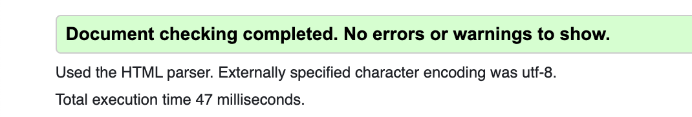
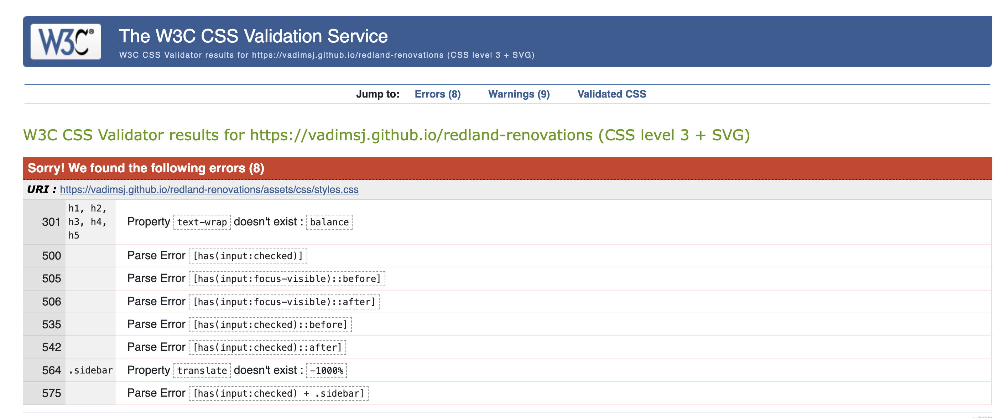
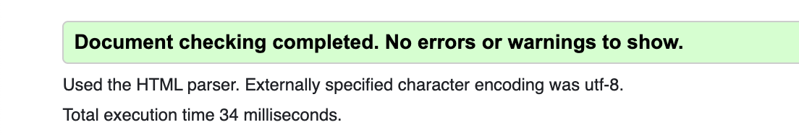
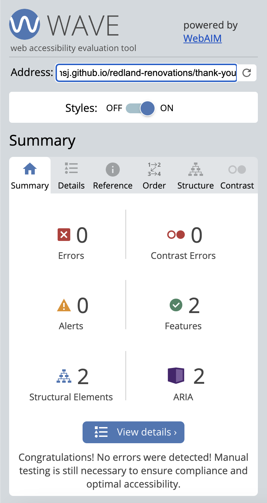
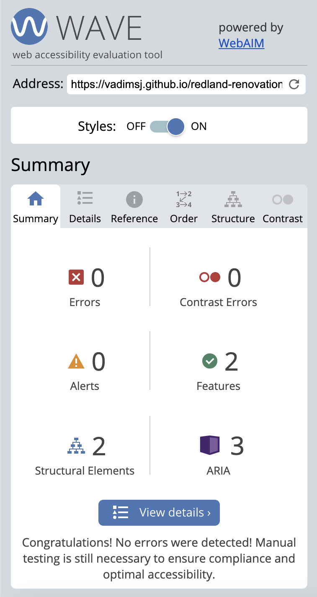

# Redland Renovations Testing Documentation

[Live website preview](https://vadimsj.github.io/redland-renovations)

[Github repository](https://github.com/vadimsj/redland-renovations)

### Table of Contents:

- [Main page testing](#main-page-testing)
  - [PageSpeed performance testing](#pagespeed-performance-testing)
  - [Validator testing](#validator-testing)
  - [Accessibility testing](#accessibility-testing)
  - [User story testing](#user-story-testing)
  - [Feature testing](#feature-testing)
  - [Unfixed Bugs](#unfixed-bugs)

- [Thank you page testing](#thank-you-page-testing)
  - [PageSpeed performance testing](#pagespeed-performance-testing-1)
  - [Validator testing](#validator-testing-1)
  - [Accessibility testing](#accessibility-testing-1)

- [Page 404 testing](#page-404-testing)
  - [PageSpeed performance testing](#pagespeed-performance-testing-2)
  - [Validator testing](#validator-testing-2)
  - [Accessibility testing](#accessibility-testing-2)

## Main page testing

### PageSpeed performance testing

- [PageSpeed Insights (Lighthouse)](https://pagespeed.web.dev/)

### Validator testing 

- HTML [W3C validator](https://validator.w3.org/nu/)
  - No errors were returned. 

  
 

- CSS [(Jigsaw) validator](https://jigsaw.w3.org/css-validator/)
  - Test returned 8 errors. These errors are expected and do not affect the performance of the website.
    
    Errors can be sorted into the following 2 categories:

      A. Errors related to the validator not recognizing new CSS properties.

      B. Errors due to the validator being unable to parse the hidden sidebar.

  
 

### Accessibility testing

- Wave.webaim [Web Accessibility Evaluation Tool](https://wave.webaim.org/)

  - No errors were returned.

  
 

### User story testing

- A. First Time Visitor Goals

    As a first-time visitor, I would like to:
  1. Identify the nature of the business and specialization of the company.

    - The home page features a large heading, "Property Renovations in Bristol," clearly identifying the nature of the business and its area of operation.

    - Below the heading, there is a paragraph providing further details about the services offered.
    
    - The home page also includes an image featuring a property typical of the Redland area.

  2. Locate where the company is based and its areas of operation.
  3. Determine what services the company offers and the scope of work undertaken.
  4. Explore the company's portfolio showcasing previously completed projects.
  5. Find essential information about the company.
  6. Contact the company.

- B. Returning Visitor Goals

    As a Ruturning visitor, I would like to:
    1. Easily navigate through the website to access different pages and return to the home page if needed.
    2. Quickly contact the company or request a callback.

- C. Website Owner Goals

    As a website owner, I would like to:
  1. Introduce the company and it's services to the website visitors.
  2. Present essential company information in a user-friendly format.
  3. Showcase the company's portfolio of previously completed works.
  4. Offer a various options for customers to get in touch.
  5. Capture the leads from incoming inquiries.

### Feature testing

### Unfixed Bugs

## Thank you page testing

### PageSpeed performance testing

### Validator testing 

- HTML [W3C validator](https://validator.w3.org/nu/)

  - No errors were returned. 

  
 

### Accessibility testing

- Wave.webaim [Web Accessibility Evaluation Tool](https://wave.webaim.org/)

  - No errors were returned.

  
 

## Page 404 testing

### PageSpeed performance testing

### Validator testing 

- HTML [W3C validator](https://validator.w3.org/nu/)

  - No errors were returned.

  
 

### Accessibility testing

- Wave.webaim [Web Accessibility Evaluation Tool](https://wave.webaim.org/)

  - No errors were returned.

  
