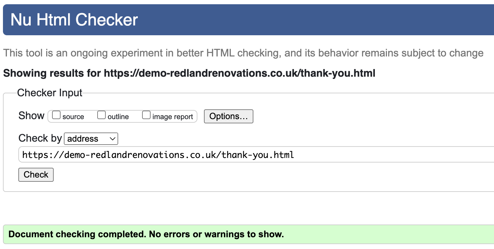

# Redland Renovations Testing Documentation

[Live website preview](https://vadimsj.github.io/redland-renovations)

[Github repository](https://github.com/vadimsj/redland-renovations)

### Contents:

- [Tools used for testing](#tools-used-for-testing)
- [User story testing](#user-story-testing)
  - [A. First Time Visitor Goals](#a-first-time-visitor-goals)
  - [B. Returning Visitor Goals](#b-returning-visitor-goals)
  - [C. Website Owner Goals](#c-website-owner-goals)
- [Automated testing](#automated-testing)
  - [Lighthouse performance testing](#lighthouse-performance-testing)
  - [W3C Markup Validator testing](#w3c-markup-validator-testing)
  - [W3C CSS (Jigsaw) Validator testing](#w3c-css-jigsaw-validator-testing)
  - [Wave Web Accessibility testing](#wave-web-accessibility-testing)
- [Manual testing](#manual-testing)
  - [Feature testing](#feature-testing)
    - [index.html](#indexhtml)
    - [thank-you.html](#thank-youhtml)
    - [404.html](#404html)
  - [Browser testing](#browser-testing)
  - [Responsiveness testing](#responsiveness-testing)
- [Unfixed Bugs](#unfixed-bugs)

 

### Tools used for testing:

- [Google Lighthouse extension](https://developer.chrome.com/docs/lighthouse/overview)
- [W3C Html validator](https://validator.w3.org/nu/)
- [W3C CSS (Jigsaw) Validator](https://jigsaw.w3.org/css-validator/)
- [WAVE Web Accessibility Evaluation Tool](https://wave.webaim.org/)

## User story testing

### A. First Time Visitor Goals

  **As a first-time visitor, I would like to:**

  **1. Identify the nature of the business and specialization of the company.**

  **2. Locate where the company is based and its areas of operation.**

  - The home page features a large heading, "Property Renovations in Bristol," clearly identifying the nature of the business and its area of operation.

  - Below the heading, there is a paragraph providing further details about the services offered and areas of operation.
    
  - The home page also includes an image featuring a property typical of the Redland area.

  **3. Determine what services the company offers and the scope of work undertaken.**

  - A detailed list of services provided is featured on the second page below the home page.

  **4. Explore the company's portfolio showcasing previously completed projects.**

  - Following the services list, there are galleries showcasing completed projects.

  **5. Find essential information about the company.**

  **6. Contact the company.**

  - The primary call-to-action button on the home page leads visitors directly to the contact us page, where the phone number and email address are displayed.

  - The contact form allows visitors to leave their own contact details and to submit messages directly.

  - Below the contact form, there is a footer with the company's registered address.

 

### B. Returning Visitor Goals

  **As a Ruturning visitor, I would like to:**

  **1. Easily navigate through the website to access different pages and return to the home page if needed.**

  - The website features a navigation bar for quick access to necessary sections.

  **2. Quickly contact the company or request a callback.**

  - The primary call-to-action button on the home page leads directly to the contact form.

 

### C. Website Owner Goals

  **As a website owner, I would like to:**

  **1. Introduce the company and it's services to the website visitors.**

  **2. Present essential company information in a user-friendly format.**

  - The content is logically organized and presented in a consecutive manner. The website's usability is intuitive, ensuring it doesn't overwhelm visitors with excessive information.

  **3. Showcase the company's portfolio of previously completed works.**

  - The website features a responsive gallery.

  **4. Offer a various options for customers to get in touch.**

  - The primary call to action leads directly to contact form that allows to submit the message directly

  - The website features additional call to action bar with the phone number and email.

  **5. Capture the leads from incoming inquiries.**

  - Backend development for this feature is not yet implemented due to being out of scope for this project.

 

## Automated testing

### Lighthouse performance testing

- Desktop

  
 

- Mobile

  
 

### W3C Markup Validator testing 

  - index.html - No errors or warnings were returned.

  
   

  - thank-you.html - No errors or warnings were returned.

  
   

  - 404.html - No errors or warnings were returned.

  
   

### W3C CSS (Jigsaw) Validator testing 

  - Validator returned a number of errors due to not recognising the modern css properties, but these errors can be ignored (listed below):

  
   

  - Validator returned a number of warnings do to being unable to check dynamic variables or not recognising the properties, but these errors can be ignored (listed below):

  
   

### Wave Web Accessibility testing

  - index.html - No errors were returned.

  
   

  - thank-you.html - No errors were returned.

  
   

  - 404.html - No errors were returned.

  
   

## Manual testing

### Feature testing

#### index.html

| Feature | Expected Outcome | Testing Performed | Result | Pass/Fail |
| --- | --- | --- | --- | --- |
|  |  |  |  |  |
| `Header + Navigation bar - mobile` |
| Logo Home button | On click scrolls to the home page (smooth scroll) | Clicked the button | Redirected to the home page | Pass |
| Logo Home button | On click logo will play the animation | Clicked the button | Animation played | Pass |
| Hamburger menu | On click, the navigation sidebar slides out and the black hamburger menu icon changes to orange X icon | Clicked the Hamburger menu icon | Navigation sidebar slid out and the black Hamburger menu icon changed to orange X icon | Pass |
| Hamburger menu | On click X icon, the sidebar menu is closed and the orange X icon changed to black Hamburger menu icon | Clicked the X icon | Sidebar menu closed and the orange X icon changed to black Hamburger menu icon | Pass |
| Sidebar animation | Sidebar slides out smoothly and the navigation links sliding out following the sidebar, one after another | Clicked the Hamburger menu icon | Animation worked as expected | Pass |
| Services link | On click scrolls to the services page (smooth scroll) | Clicked the link | Page scrolled to the services page | Pass |
| Gallery link | On click scrolls to the first Gallery section (smooth scroll) | Clicked the link | Page scrolled to the first Gallery section | Pass |
| About us link | On click scrolls to the About us section (smooth scroll) | Clicked the link | Page scrolled to the  About us section | Pass |
| Contact us link | On click scrolls to the Contact us section (smooth scroll) | Clicked the link | Page scrolled to the Contact us section | Pass |
|  |  |  |  |  |
| `Header + Navigation bar - desktop` |
| Logo Home button | On click the user will be redirected to the home page | Clicked the button | Redirected to the home page | Pass |
| Logo Home button | On click logo will play the animation | Clicked the button | Animation worked as expected | Pass |
| Services link | On click scrolls to the services page (smooth scroll) | Clicked the link | Page scrolled to the Services page | Pass |
| Gallery link | On click scrolls to the first Gallery section (smooth scroll) | Clicked the link | Page scrolled to the first Gallery section | Pass |
| About us link | On click scrolls to the About us section (smooth scroll) | Clicked the link | Page scrolled to the About us section | Pass |
| Contact us link | On click scrolls to the Contact us section (smooth scroll) | Clicked the link | Page scrolled to the Contact us section | Pass |
|  |  |  |  |  |
| `Home page` |
| Call-to-action button | Animated light reflection effect periodically slides across the button | Observed the animation | Animation works as expected | Pass |
| Call-to-action button | On click scrolls to the Contact us section (smooth scroll) | Clicked the button | Page scrolled to the Contact us section | Pass |
| Call-to-action button | On hover arrow icon on the button shifts right | Hovered over the button | Animation worked as expeted | Pass |
|  |  |  |  |  |
| `Call-to-action bar` |
| Text line reveal-on-scroll effect (limited support) | Text reveals line by line on scroll down | Scrolled the page | Animation worked as expected | Pass |
| Phone number | On click opens the phone app with the pre-dialed number | Clicked the phone number | Phone app with the pre-dialed number opened | Pass |
| Email address | On click opens the email client with the pre-entered email address | Clicked the email address | Opened the email client with the pre-entered email address | Pass |
|  |  |  |  |  |
| `Gallery section` |
| Toggle fold images button | On click reveals/folds additional images in the gallery sections | Clicked the button | Revealed/folded images | Pass |
| Toggle fold images button | On click changes the button icon from white arrow down when folded to orange arrow up unfolded | Clicked the button | The icon changed from white arrow up to orange arrow down | Pass |
|  |  |  |  |  |
| `USP bar` |
| Text line reveal-on-scroll effect (limited support) | Text reveals line by line on scroll down | Scrolled the page | Animation worked as expected | Pass |
|  |  |  |  |  |
| `Contact us page` |
| Phone number | On click opens the phone app with the pre-dialed number | Clicked the phone number | Phone app with the pre-dialed number opened | Pass |
| Phone number | On hover text color changes to orange | Hovered over the phone number | Text color changed to orange | Pass |
| Email address | On click opens the email client with the pre-entered email address | Clicked the email address | Opened the email client with the pre-entered email address | Pass |
| Email address | On hover text color changes to orange | Hovered over the phone number | Text color changed to orange | Pass |
| Form | Selected field in the form is highlighted with the orange outline | Selected the form filed | Selected field in the form highlighted with the orange outline | Pass |
| Form | Requires a valid details for each field | Attempted to enter invalid details | Received a prompt alerting to entred the valid details | Pass |
| Submit button | On successful submission redirects user to the Thank you page  | Clicked the button | Redirected to the Thank you page | Pass |
| `Footer` |
|  |  |  |  |  |
| Parallax effect | Page appears to slide over the static footer on scroll | Scrolled the page | Footer displayed as expected | Pass |
 

#### thank-you.html

| Feature | Expected Outcome | Testing Performed | Result | Pass/Fail |
| --- | --- | --- | --- | --- |
|  |  |  |  |  |
| Call-to-action button | Animated light reflection effect periodically slides across the button | Observed the animation | Animation works as expected | Pass |
| Call-to-action button | On hover arrow icon on the button shifts right | Hovered over the button | Animation worked as expeted | Pass |
| Call-to-action button | On click redirects user to the Home page | Clicked the button | Redirected to the Home page | Pass |
 

#### 404.html

| Feature | Expected Outcome | Testing Performed | Result | Pass/Fail |
| --- | --- | --- | --- | --- |
|  |  |  |  |  |
| Call-to-action button | Animated light reflection effect periodically slides across the button | Observed the animation | Animation works as expected | Pass |
| Call-to-action button | On hover arrow icon on the button shifts right | Hovered over the button | Animation worked as expeted | Pass |
| Call-to-action button | On click redirects user to the Home page | Clicked the button | Redirected to the Home page | Pass |
 

### Browser testing

| Page/Section | Result | Pass/Fail |
| --- | --- | --- |
|  |  |  |  |  |
 `Chrome` 
| Home | Page displayed as expected | Pass |
| Services | Page displayed as expected | Pass |
| Call-to-action bar | Section displayed as expected | Pass |
| Gallery | Page displayed as expected | Pass |
| About us | Section displayed as expected | Pass |
| USP bar | Section displayed as expected | Pass |
| Contact us | Page displayed as expected | Pass |
| footer | Section displayed as expected | Pass |
| Thank you | Page displayed as expected | Pass |
| 404 | Page displayed as expected | Pass |
|  |  |  |  |  |
 `Firefox` 
| Home | Page displayed as expected | Pass |
| Services | Page displayed as expected | Pass |
| Call-to-action bar | Section displayed as expected | Pass |
| Gallery | Page displayed as expected | Pass |
| About us | Section displayed as expected | Pass |
| USP bar | Section displayed as expected | Pass |
| Contact us | Page displayed as expected | Pass |
| footer | Section displayed as expected | Pass |
| Thank you | Page displayed as expected | Pass |
| 404 | Page displayed as expected | Pass |
|  |  |  |  |  |
 `Safari` 
| Home | Page displayed as expected | Pass |
| Services | Page displayed as expected | Pass |
| Call-to-action bar | Section displayed as expected | Pass |
| Gallery | Page displayed as expected | Pass |
| About us | Section displayed as expected | Pass |
| USP bar | Section displayed as expected | Pass |
| Contact us | Page displayed as expected | Pass |
| footer | Section displayed as expected | Pass |
| Thank you | Page displayed as expected | Pass |
| 404 | Page displayed as expected | Pass |
|  |  |  |  |  |

### Responsiveness testing

| Device | Screen size | Result | Pass/Fail |
| --- | --- | --- | --- |
|  |  |  |  |  |
| Samsung Galaxy S20 ultra | 412x915 | Displayed as expected | Pass |
| iPhone 12 pro | 390x844 | Displayed as expected | Pass |
| iPhome 14 pro max | 430x932 | Displayed as expected | Pass |
| iPad mini | 768x1024 | Displayed as expected | Pass |
| iPad pro | 1024x1366 | Displayed as expected | Pass |
| Macbook air | 2560 × 1600 | Displayed as expected | Pass |

### Unfixed Bugs

  - No bugs were found during the testing.

